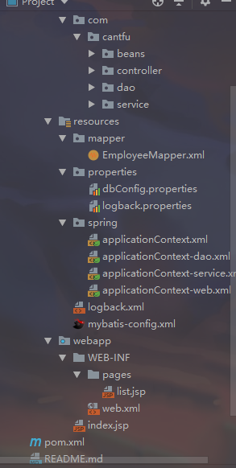

## SSM+logback整合要点
此项目Demo是Spring、SpringMVC、Mybatis整合的基本配置，可下载运行。包含了logback和lombok。

[TOC]


### 项目环境
 1. jdk 1.8
 2. tomcat 9.0.14
 3. spring 4.3.17.RELEASE
 4. mybatis 3.4.6


### 项目目录



### pom.xml

``` xml
<properties>
      <project.build.sourceEncoding>UTF-8</project.build.sourceEncoding>
      <maven.compiler.source>1.8</maven.compiler.source>
      <maven.compiler.target>1.8</maven.compiler.target>
      <spring.version>4.3.17.RELEASE</spring.version>
      <mybatis.version>3.4.6</mybatis.version>
      <slf4j.version>1.7.25</slf4j.version>
      <logback.version>1.2.3</logback.version>

  </properties>

  <dependencies>
    <dependency>
      <groupId>junit</groupId>
      <artifactId>junit</artifactId>
      <version>4.11</version>
      <scope>test</scope>
    </dependency>
      <dependency>
          <groupId>org.projectlombok</groupId>
          <artifactId>lombok</artifactId>
          <version>1.18.4</version>
      </dependency>

      <!-- spring框架相关包 -->
      <dependency>
          <groupId>org.springframework</groupId>
          <artifactId>spring-test</artifactId>
          <version>${spring.version}</version>
      </dependency>

      <dependency>
          <groupId>org.springframework</groupId>
          <artifactId>spring-core</artifactId>
          <version>${spring.version}</version>
          <!--排除了commons-logging-->
          <exclusions>
              <exclusion>
                  <groupId>commons-logging</groupId>
                  <artifactId>commons-logging</artifactId>
              </exclusion>
          </exclusions>
      </dependency>
      <dependency>
          <groupId>org.springframework</groupId>
          <artifactId>spring-oxm</artifactId>
          <version>${spring.version}</version>
      </dependency>
      <dependency>
          <groupId>org.springframework</groupId>
          <artifactId>spring-tx</artifactId>
          <version>${spring.version}</version>
      </dependency>
      <dependency>
          <groupId>org.springframework</groupId>
          <artifactId>spring-jdbc</artifactId>
          <version>${spring.version}</version>
      </dependency>
      <dependency>
          <groupId>org.springframework</groupId>
          <artifactId>spring-aop</artifactId>
          <version>${spring.version}</version>
      </dependency>
      <dependency>
          <groupId>org.springframework</groupId>
          <artifactId>spring-context</artifactId>
          <version>${spring.version}</version>
      </dependency>
      <dependency>
          <groupId>org.springframework</groupId>
          <artifactId>spring-context-support</artifactId>
          <version>${spring.version}</version>
      </dependency>
      <dependency>
          <groupId>org.springframework</groupId>
          <artifactId>spring-expression</artifactId>
          <version>${spring.version}</version>
      </dependency>
      <dependency>
          <groupId>org.springframework</groupId>
          <artifactId>spring-orm</artifactId>
          <version>${spring.version}</version>
      </dependency>
      <dependency>
          <groupId>org.springframework</groupId>
          <artifactId>spring-web</artifactId>
          <version>${spring.version}</version>
      </dependency>
      <dependency>
          <groupId>org.springframework</groupId>
          <artifactId>spring-webmvc</artifactId>
          <version>${spring.version}</version>
      </dependency>
      <!-- spring框架包 -->

      <!-- mybatis框架包    数据库相关-->
      <dependency>
          <groupId>mysql</groupId>
          <artifactId>mysql-connector-java</artifactId>
          <version>8.0.13</version>
      </dependency>
      <dependency>
          <groupId>org.mybatis</groupId>
          <artifactId>mybatis</artifactId>
          <version>${mybatis.version}</version>
      </dependency>

      <dependency>
          <groupId>org.mybatis</groupId>
          <artifactId>mybatis-spring</artifactId>
          <version>1.3.0</version>
      </dependency>
      <dependency>
          <groupId>com.mchange</groupId>
          <artifactId>c3p0</artifactId>
          <version>0.9.5.2</version>
      </dependency>
      <!-- mybatis框架包 -->


      <!--************日志服务slf4j+logback****************-->
      <!--jcl-over-slf4j : 桥接器，将JCL的日志输出重定向到Slf4j中。-->
      <dependency>
          <groupId>org.slf4j</groupId>
          <artifactId>jcl-over-slf4j</artifactId>
          <version>${slf4j.version}</version>
      </dependency>
      <dependency>
          <groupId>org.slf4j</groupId>
          <artifactId>slf4j-api</artifactId>
          <version>${slf4j.version}</version>
      </dependency>
      <dependency>
          <groupId>ch.qos.logback</groupId>
          <artifactId>logback-classic</artifactId>
          <version>${logback.version}</version>
      </dependency>

      <!-- jsp相关jstl标签类 -->
      <dependency>
          <groupId>jstl</groupId>
          <artifactId>jstl</artifactId>
          <version>1.2</version>
      </dependency>
      <dependency>
          <groupId>taglibs</groupId>
          <artifactId>standard</artifactId>
          <version>1.1.2</version>
      </dependency>
      <dependency>
          <groupId>javax.servlet</groupId>
          <artifactId>javax.servlet-api</artifactId>
          <version>3.1.0</version>
      </dependency>
  </dependencies>
```

### web.xml

#### 配置springMVC

> 配置contextConfigLocation为applicationContext.xml。此文件引入了属性文件和各层配置文件（applicationContext-*.xml）。

```xml
  <!--spring mvc DispatcherServlet配置-->
  <servlet>
    <servlet-name>spring</servlet-name>
    <servlet-class>org.springframework.web.servlet.DispatcherServlet</servlet-class>
    <init-param>
      <param-name>contextConfigLocation</param-name>
      <param-value>classpath:spring/applicationContext.xml</param-value>
    </init-param>
    <load-on-startup>1</load-on-startup>
  </servlet>
  <servlet-mapping>
    <servlet-name>spring</servlet-name>
    <url-pattern>/</url-pattern>
  </servlet-mapping>
```

#### 解决乱码的过滤器

> CharacterEncodingFilter
```xml
<!-- 解决乱码的过滤器 -->
  <filter>
    <filter-name>CharacterEncodingFilter</filter-name>
    <filter-class>org.springframework.web.filter.CharacterEncodingFilter</filter-class>
    <init-param>
      <param-name>encoding</param-name>
      <param-value>utf-8</param-value>
    </init-param>

    <init-param>
      <param-name>forceEncoding</param-name>
      <param-value>true</param-value>
    </init-param>
  </filter>
  <filter-mapping>
    <filter-name>CharacterEncodingFilter</filter-name>
    <url-pattern>/*</url-pattern>
  </filter-mapping>
```

#### spring的配置
```xml
 <!-- spring 配置 -->
  <context-param>
    <param-name>contextConfigLocation</param-name>
    <param-value>classpath:spring/*.xml</param-value>
  </context-param>
  <listener>
    <listener-class>org.springframework.web.context.ContextLoaderListener</listener-class>
  </listener>
```
### spring配置文件

#### applicationContext.xml

> 引入了属性文件和各层配置文件（applicationContext-*.xml）

```xml
<context:property-placeholder location="classpath:properties/*.properties" />

<import resource="classpath:spring/applicationContext-*.xml" />
```

#### applicationContext-web.xml

> 1. 视图解析器InternalResourceViewResolver
> 2. 扫描controller包
> 3. 开启注解映射的支持
> 4. 允许静态资源访问

```xml
<!--开启注解映射的支持-->
<mvc:annotation-driven />
<!--允许静态资源访问-->
<mvc:default-servlet-handler />

<!--视图解析器-->
<bean id="viewResolver" class="org.springframework.web.servlet.view.InternalResourceViewResolver">
    <property name="prefix" value="/WEB-INF/pages/" />
    <property name="suffix" value=".jsp" />
</bean>
<!--扫描controller包-->
<context:component-scan base-package="com.cantfu.controller" />
```

#### applicationContext-service.xml

> 1. 扫描Service包
> 2. 配置事务管理器
> 3. 事务采用全注解方式

```xml
<!--扫描Service包-->
<context:component-scan base-package="com.cantfu.service" />

<!--配置事务管理器-->
<bean id="transactionManager" class="org.springframework.jdbc.datasource.DataSourceTransactionManager">
    <property name="dataSource" ref="dataSource" />
</bean>
<!--事务采用全注解方式-->
<tx:annotation-driven transaction-manager="transactionManager" />
```

#### applicationContext-dao.xml

> 1. 配置数据源，如C3P0的ComboPooledDataSource
> 2. mybatis配置：SqlSessionFactoryBean
> 3. 扫描dao下的包，让service层可以自动注入dao接口

``` xml
<!--配置数据源-->
<bean id="dataSource" class="com.mchange.v2.c3p0.ComboPooledDataSource" destroy-method="close">
    <property name="driverClass" value="${jdbc.driver}" />
    <property name="jdbcUrl" value="${jdbc.url}"/>
    <property name="user" value="${jdbc.username}"/>
    <property name="password" value="${jdbc.password}"/>

    <!-- 关键配置 -->
    <!--初始化时获取三个连接，取值应在minPoolSize与maxPoolSize之间。Default: 3 -->
    <property name="initialPoolSize" value="${c3p0.initialPoolSize}" />
    <!--连接池中保留的最小连接数。Default: 2 -->
    <property name="minPoolSize" value="${c3p0.minPoolSize}"/>
    <!--连接池中保留的最大连接数。Default: 15 -->
    <property name="maxPoolSize" value="${c3p0.maxPoolSize}"/>
    <!--当连接池中的连接耗尽的时候c3p0一次同时获取的连接数。Default: 3 -->
    <property name="acquireIncrement" value="${c3p0.acquireIncrement}"/>
    <!-- 性能配置 -->
    <!-- 控制数据源内加载的PreparedStatements数量。如果maxStatements与maxStatementsPerConnection均为0，则缓存被关闭。Default: 0 -->
    <property name="maxStatements" value="${c3p0.maxStatements}"/>
    <!-- maxStatementsPerConnection定义了连接池内单个连接所拥有的最大缓存statements数。Default: 0 -->
    <property name="maxStatementsPerConnection" value="${c3p0.maxStatementsPerConnection}"/>
    <!--最大空闲时间,60秒内未使用则连接被丢弃。若为0则永不丢弃。Default: 0 -->
    <property name="maxIdleTime" value="${c3p0.maxIdleTime}" />

</bean>
<!--mybatis相关配置-->
<bean id="sqlSessionFactory" class="org.mybatis.spring.SqlSessionFactoryBean">
    <!--注入数据源-->
    <property name="dataSource" ref="dataSource" />
    <!--扫描mybatis核心配置文件-->
    <property name="configLocation" value="classpath:mybatis-config.xml" />
    <!--扫描java bean，使用别名-->
    <property name="typeAliasesPackage" value="com.cantfu.beans" />
    <!--扫描mapper配置文件-->
    <property name="mapperLocations" value="classpath:mapper/*.xml" />
</bean>
<!--扫描 dao 接口包，即可自动注入到service的属性中-->
<bean class="org.mybatis.spring.mapper.MapperScannerConfigurer" >
    <property name="sqlSessionFactoryBeanName" value="sqlSessionFactory" />
    <property name="basePackage" value="com.cantfu.dao" />
</bean>
```

#### mybatis-config.xml

> 此配置是mybatis的全局配置，其中数据源、事务等在spring配置中。

### 属性文件配置
#### dbConfig.properties
> 用于dao层的配置文件(数据源)
```properties
jdbc.driver=com.mysql.cj.jdbc.Driver
jdbc.url=jdbc:mysql://localhost:3306/ssmdemo?useUnicode=true&characterEncoding=utf8&useSSL=false&serverTimezone=Hongkong
jdbc.username=
jdbc.password=


c3p0.initialPoolSize=3
c3p0.minPoolSize=2
c3p0.maxPoolSize=15
c3p0.acquireIncrement=3

c3p0.maxStatements=8
c3p0.maxStatementsPerConnection=5
c3p0.maxIdleTime=600
c3p0.numHelperThreads=10
c3p0.idleConnectionTestPeriod=60

```
### 整合slf4j+logback日志服务
1. ### pom.xml中加入依赖

   ```xml
   <dependency>
       <groupId>org.slf4j</groupId>
       <artifactId>jcl-over-slf4j</artifactId>
       <version>${slf4j.version}</version>
   </dependency>
   <dependency>
       <groupId>org.slf4j</groupId>
       <artifactId>slf4j-api</artifactId>
       <version>${slf4j.version}</version>
   </dependency>
   <dependency>
       <groupId>ch.qos.logback</groupId>
       <artifactId>logback-classic</artifactId>
       <version>${logback.version}</version>
   </dependency>
   ```

2. 在类路径下编写logback.xml文件（通常在src/main/resource下）

   ```xml
   <?xml version="1.0" encoding="UTF-8"?>
   <!DOCTYPE configuration>
   <configuration>
      <property resource="properties/logback.properties" />
      <!--控制台输出 -->
      <appender name="stdout" class="ch.qos.logback.core.ConsoleAppender">
         <encoder>
            <pattern>%date{yyyy-MM-dd HH:mm:ss.SSS} %-5level[%thread]%logger{56}.%method\(\):%L -%msg%n</pattern>
         </encoder>
      </appender>
      <!--文件输出 -->
      <appender name="logfile" class="ch.qos.logback.core.rolling.RollingFileAppender">
           <Encoding>UTF-8</Encoding>
           <File>${log.base}comment.log</File>
           <rollingPolicy class="ch.qos.logback.core.rolling.TimeBasedRollingPolicy">
               <FileNamePattern>${log.base}comment.%d{yyyy-MM-dd}.log.zip</FileNamePattern>
           </rollingPolicy>
           <encoder>
               <pattern>%date|%msg%n</pattern>
           </encoder>
       </appender>
   
       <root>
           <level value="${log.level}" />
           <appender-ref ref="${log.appender.ref}" />
       </root>
   </configuration>
   ```

3. 在相同路径下创建properties/logback.properties文件，用更好的发布（配置）

   ```properties
   log.base=D:\\log
   log.level=DEBUG
   # 日志输出，根据log.xml的appender的name配置,此处为控制台
   log.appender.ref=stdout
   ```

4. 使用：和一般logger的使用没区别。

### 本Demo使用方法
 1. clone 本demo到本地,idea打开项目
 2. 建立MySQL数据库 **ssmdemo**，使用sql文件夹的sql语句建表
 3. 修改dbConfig.properties文件的用户、密码
 4. 在Tomcat下运行
 5. 访问http://localhost:8080/emps

 ### 特别说明
 项目中使用了lombok，所以bean中没有getter、setter等方法。